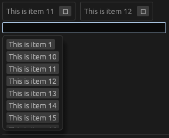
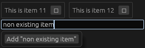
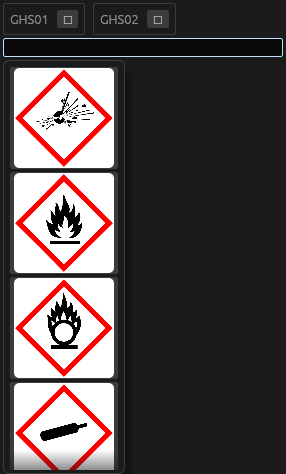

# A select2 like widget for egui

Support local or remote fetching data.
Possible custom rendering of the drop down items.

There is space for improvements. Pull requests are welcome.





## Inspiration

<https://select2.org/>

## Run examples

```bash
cargo run --example basic|remote|pictures
```
