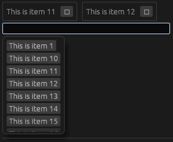
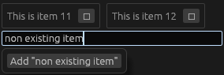
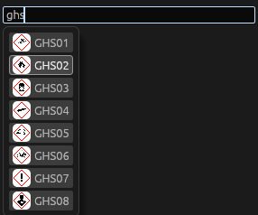

# A select2 like widget for [egui](https://github.com/emilk/egui)

- Support local or remote data fetching.
- Possible custom rendering of the drop down items.
- Multiple or unique selection.
- Can be disabled.
- Add new entries (when `read_only` is false)
- Suggestions auto close on select or not.

There is space for improvements. Pull requests are welcome.





## Inspiration

<https://select2.org/>

## Usage

Typical usage in egui:

Define your select in your app.

```
struct MyApp {
    my_select: EguiSelect2,
...
}
```

Define your load_suggestions function.

```
fn my_load_suggestions(suggestions: SharedSelect2Items, limit: usize, offset: usize, query: &str) {
    // Do not unwrap() in your code, handle the error instead.
    let mut locked_suggestions = suggestions.lock().unwrap();

    // Perform your request (local or remote) using `offset`, `limit`, and `query`.
    // Turn the results into a `SelectItems` struct and assign it to `locked_suggestions`.
    ...
    *locked_suggestions = Some(SelectItems { items, total });
}
```

Initialize your select with default values.
And attach your load_suggestions function.

```
impl Default for MyApp {
    fn default() -> Self {
        let mut my_select = EguiSelect2::default();
        // required
        my_select.load_suggestions = Box::new(my_load_suggestions);

        Self { my_select }
    }
}
```

Use the select in your UI.
Don't forget to call `check_loading` before `ui`.

```
impl eframe::App for MyApp {
    fn ui(&mut self, ui: &mut egui::Ui, _frame: &mut eframe::Frame) {
        // required
        self.my_select.check_loading();
        self.my_select.ui(ui);
    }
}
```

## Data

Please see examples.

### Suggestions

The suggestions are represented as a shareable struct:

```bash
pub type SharedSelect2Items = Arc<Mutex<Option<SelectItems>>>;
```

```bash
pub struct SelectItem {
    pub id: Option<String>,
    pub label: String,
}

pub struct SelectItems {
    pub items: Vec<SelectItem>,
    pub total: usize,
}
```

`id` is expected to be set for existing suggestions and `None` for newly entered items.

### Suggestion formatting

The suggestions format are represented as a shareable function:

```bash
pub type FormatSuggestionFn = Arc<dyn Fn(&SelectItem) -> String + Send + Sync>;
```

### New items validation

The new items can be validated using a shareable function:

```bash
pub type ValidateNewItemFn = Arc<dyn Fn(&str) -> bool + Send + Sync>;
```

### Translations

The strings can be translated using the `translations` parameter.

```bash
pub struct Translations {
    pub loading: String,
    pub no_results: String,
    pub add: String,
    pub clear_all: String,
    pub hint: String,
}
```

## Parameters

- `load_suggestions: LoadSuggestionsFn` The function to load suggestions. REQUIRED

- `format_suggestion: FormatSuggestionFn` The function to format a suggestion in the dropdown. OPTIONAL - default is a simple string.

- `pub validate_new_item: ValidateNewItemFn` The function to validate a new item entered by the user. OPTIONAL - default is no validation.

- `maximum_suggestions_number: usize` The maximum number of suggestions to load at once. OPTIONAL - default is 10.

- `minimum_input_length: usize` The minimum number of characters required to trigger a suggestion load. OPTIONAL - default is 1.

- `scroll_min_height: f32` The scroll min height. OPTIONAL - default is 400px.

- `read_only: bool` Whether the widget is read-only. Setting this to `false` allows the user to enter new items. OPTIONAL - default is `true`.

- `close_on_select` Whether to close the widget when a suggestion is selected. OPTIONAL - default is `true`.

- `disabled` Whether the widget is disabled. OPTIONAL - default is `false`.

- `multiple` Whether the widget allows multiple selections. OPTIONAL - default is `false`.

- `show_border` Whether to show a border around the widget. OPTIONAL - default is `false`.

- `translations` The translations to use for the widget. OPTIONAL - default is no translations.

## Selected values

Selected values can be retrieved with the `selected` attribute as a `Vec<SelectItem>`.

```bash
self.my_select.selected.iter().for_each(|item| {
    ui.label(item.label.clone());
});
```

## Run examples

```bash
cargo run --example basic|remote|pictures|disabled|validate
```
